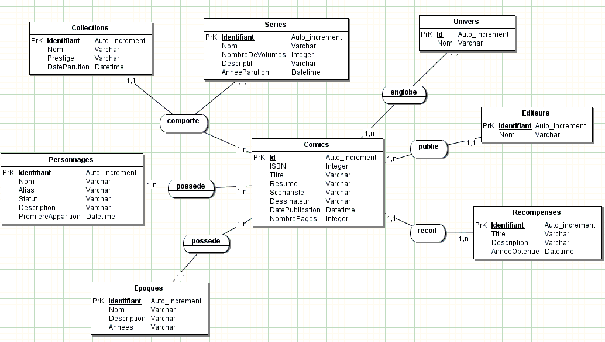

# Mcd-comics

## Sujet de l'exercice 

A partir du MCD reproduire une base de données.

Travail individuel.

**Livrables**

* Un fichier d'import de la base de données dans un repo git.
* Un fichier décrivant la démarche et les choix.
